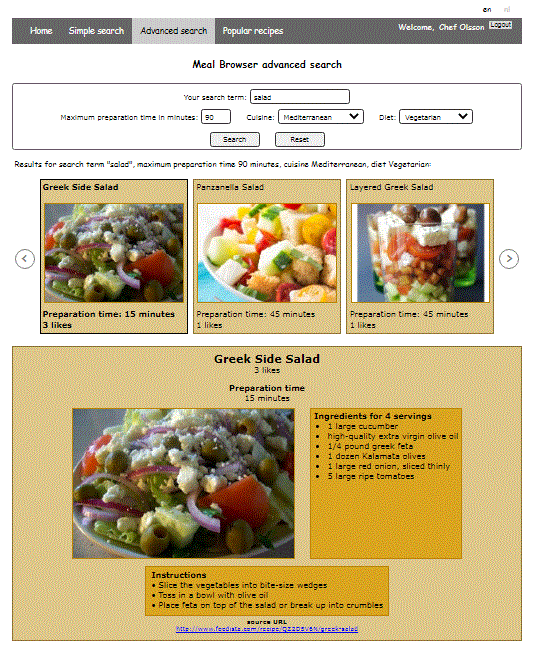

# Meal Browser installatiehandleiding #

## Inhoud ##

* [Inleiding](#inleiding)
* [Installeren en starten](#installeren-en-starten)

## Inleiding ##

Meal Browser is een tweetalige web applicatie die het mogelijk maakt om naar recepten te zoeken.
Daartoe maakt Meal Browser gebruik van de spoonacular API.
Met deze API kan een grote hoeveelheid recepten worden doorzocht.

Met de functionaliteit "eenvoudig zoeken" helpt Meal Browser de gebruiker om recepten te vinden op basis van een
zoekterm. Dit komt van pas om te zoeken naar een specifiek recept waarvan de naam grotendeels bekend is (zoals bij
zoekterm "chicken salad sandwich") of naar een categorie van recepten (zoals bij zoekterm "fruit salad").

Met de functionaliteit "uitgebreid zoeken" kan de gebruiker een aantal criteria toepassen om te zoeken naar
recepten met de gewenste eigenschappen. Zo kan bijvoorbeeld worden gezocht naar een vegetarische salade uit de
Mediterraanse keuken die binnen 90 minuten bereid kan worden.

Ten slotte kan de gebruiker zich laten inspireren door een actueel overzicht van populaire recepten, die bij
menige tafelgast in de smaak zullen vallen.

Buiten het zoeken naar recepten worden ook gebruikersregistratie, inloggen, uitloggen en het wijzigen van
gebruikersgegevens ondersteund. Hiermee kan in een latere versie bijvoorbeeld een lijst van favoriete recepten voor
geregistreerde gebruikers worden verbonden.

## Installeren en starten ##

Om Meal Browser te installeren zijn Node.js en npm als platform en package manager
nodig. Wanneer deze zijn geïnstalleerd kunnen de volgende stappen worden gevolgd.
1. Clone dit project.
2. Alle benodigde packages zijn al geconfigureerd. Geef om de benodigde dependencies te installeren het commando
   `npm install`.
3. Wanneer NPM vulnerabilities rapporteert kunnen deze worden verholpen met `npm audit fix`. Volg hiervoor de
   instructies.
4. De benodigde API key is al verwerkt in de code. Hiervoor is dus geen verdere actie nodig.
5. Om de applicatie te starten, geef je het commando `npm run start`.
